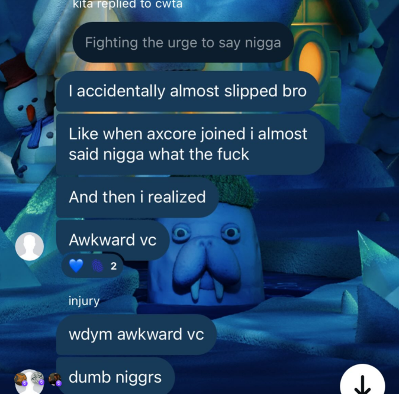
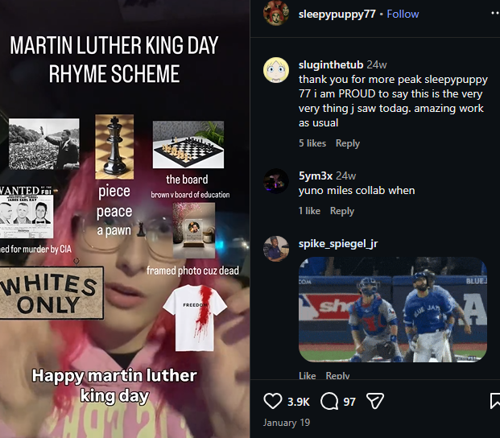
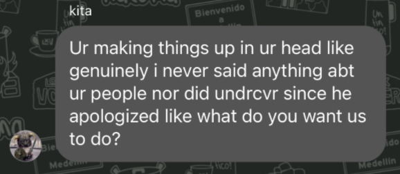
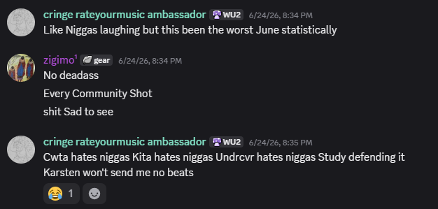

# Are you noticing a pattern?

Prejudice. The pattern is prejudice. That's how every one of these posts start.

Whether you're an active or passive listener of anything on SoundCloud that contains rap, backed by dreamy, ambient passages, or melancholic melodies, if you've been active for a couple weeks, you are likely aware of the following:

- Popular producers such as cwta, kita, undrcvr, etc. being called out for being problematic, with allegations including racism .

- Popular artist "Sleepypuppy77" catching fire for their series "Rap is Easy," in which she mimics styles of Black artists (such as Jorjiana and LAZER DIM, with the most egregious being a song "shouting out" Dr. Martin Luther King Jr.)

I think we've lost the plot...

While many were quick to call out and poke fun at these artists for these choices I feel like it's important to still touch on how much this has happened within the seemingly small, largely supportive ecosystem of "underground music."

---

Let's head back to 2020. Around this time, popular artist Notlieu was being exposed for heavily using racial slurs, making fun of sexual assault victims, and overall being egotistical. While Lieu was quick to explain, quickly apologizing, many supporters came to their defense, explaining that they were young at the time, the slurs weren't targeted, and that it was "just a word."[^1]

I'm not bringing this up just because; this exact situation is a reflection of the talking points that people exercise in an attempt to justify their support and keeping the peace. This time it's not the fans. It's the artists themselves.

... 

---

A lot of people (including myself) are quick to get upset at the racism, but they do not take the time to notice the repetition. It is the *repetition*, the predictability of said racism. The *cycle* of the same talking points used by these people to avoid an apology or any amount of self reflection. They speak about their "intention," their "integrity" and how they have so much respect for the scene that they consistently study and learn *nothing from.* They'd like you to believe that they were completely ignorant, that they "all said it" and no one policed it. However, ignorance is not allowance. Larger counterpoint:

### These people are aware of the society that we live in.

While all of the artists previously mentioned are 16-18 now, it should be noted that they all live in the United States, and are aware of the anti-Black sentiment that people face, and how it seeps into almost *everything* we view. Their age is irrelevant, because the *awareness* is enough.  

They are aware of the environment that has allowed many of the artists that they work with to ascend to the heights that they are at now. They are aware of how this transformation is reflected, whether explicitly stated or not. They are aware that the artists they produce music for and closely work with are a *majority Black* and continued to make thinly-coated, racist remarks packaged as light, uplifting usage of the N word or deep understanding and respect for "the culture." They are not for any culture, they are for social and financial transaction.

I am also equally disappointed in my contemporaries and people that I consider friends for their response, but not in the way that may come to mind. Many were (are) quick to go to Instagram or Twitter to either make a callout post or quickly joke about it, and are quick to say that "no one will learn until it happens to them." That ends up getting us as both creators and listeners into an endless loop that has, and will continue to end in complete apathy and dismissal *to* prejudice.

I'm upset with the inability to see further and realize that there is a large, long discussion to be had about these patterns that plague a "niche" that we all, directly or indirectly, contribute to and benefit from. I say this as someone who was deliberately apathetic and dismissive of this situation.

### Wait so why do *you* suddenly care now?

I've always *cared*. But at some point, you realize it's a cycle. It's a cycle I've subconsciously taken note of way before I even became a listener. A cycle that many of us have had to face and ignore head on to not seem *too woke.* The music aided with that, allowing us to see ourselves in people that looked and sounded just like us. 

When I say that this cycle will continue to end in apathy and dismissal, it is because *I* also ended up becoming apathetic to these situations. A lot of these exposes were chalked up to "Yeah this guy's bad, won't listen to him anymore!" While I understand that I do not reflect the average person, I also understand that these events can make one numb to situations like these.

It's not a good look when *three producers* are called out in the *same month* for being a collective antithesis to the idea that this microscene is inclusive. It's not a good look when the news of the week is that "*another Queer White Person* is attempting to relate to Black people and wailing about intention when it doesn't work out." This pattern of creators using Black art as a form of post-irony shits and giggles is gross, and it is a cycle that will continue to infect and paralyze you from speaking up if you **allow it to.**

## So what?

I've organized some points for all players of the game into neat little bullet lists:

- Artists:
> - Speak the fuck up. Stop making Instagram story posts about these people that expire after 24 hours. 
> - **Use your *permanent* voice to speak on these topics and start an actual discussion.**
> - Stop gossiping about actual problematic figures in these communities. **Whether you want to believe it or not, you are aiding in their comfort by allowing them to cower behind Google Docs apologies and disabling their comments.**
> - Stop associating yourself with people like this. I sincerely don't give a shit if those Repost Network splits are working out for your pockets. Stop coming out to their release dates, stop hyping up their music, stop!

Listeners:
> - Speak up. Make fellow listeners aware of these people's allegations.
> - Question those you platform. Listen to victims of any abuse.
> - Stop giving them money if these things cloud your perception of them!! You wanna still listen to it? Fine! Pirate it, listen to reuploads! 
> - Stop hyping up their music!!! There are hundreds of artists that partake in this scene that you listen to... that *aren't* racist!!!!

Blogs:
> - Vet your guests. You all network with other pages, you should be able to ask around.
> - Stop allowing these people to pay for promotion on your page.... Hyperpop Daily I'm looking at you..

Everyone has some level of ignorance but we don't have to *collaborate* on ignorance. 

-Zavi

[^1]: https://www.youtube.com/watch?v=zaEbDeG8yVg