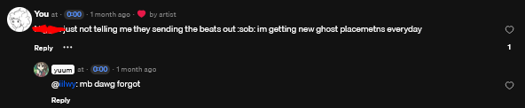
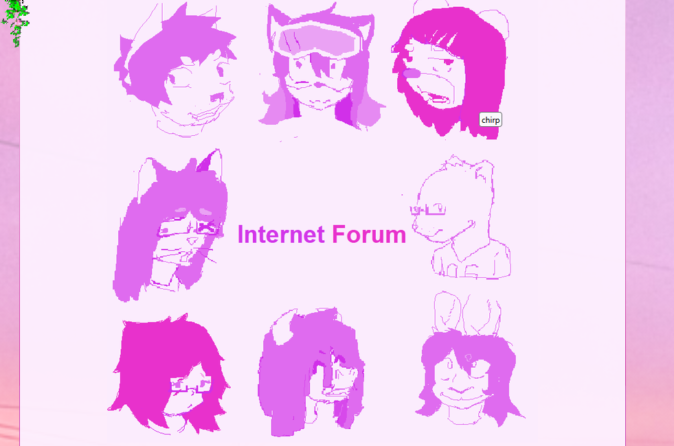
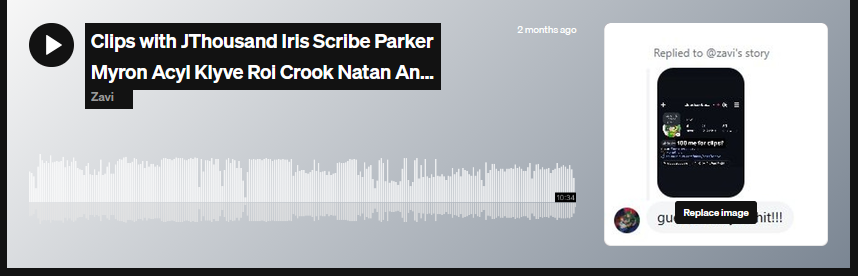
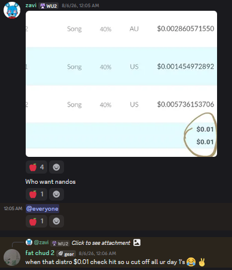
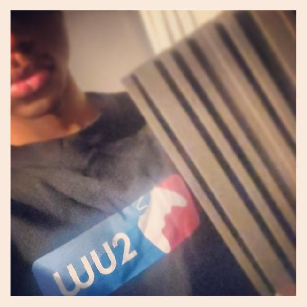
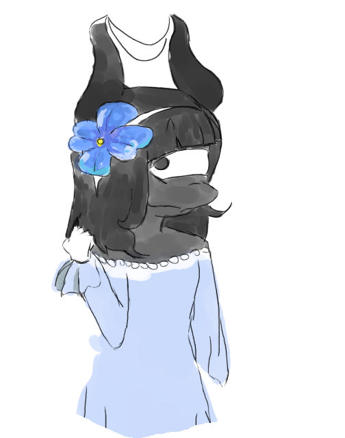

# Recap?

If you're reading this, I've turned 18. Probably today? I don't know, I wrote this a while in advance. I figured it's important to document the cool things I've been doing in the past 8 months to a year.

## Creative stuff
The stuff that I'd like to think you're here for, in order of importance:
1. I started an art/music group with my friends and held an online concert. It was fun.
2. I started experimenting a lot more with drawing anthropomorphic animals, and some people commissioned me when I needed it. That was fun.
> - I also did [Art Fight](https://artfight.net/~myrrrraaaaa) with .. mostly my girlfriend. 10 attacks, 3 defenses. We take it in stride.
3. A lot more people have been using my beats... a bit *too* many...

I was not notified that this song even existed. I know I sent a melody to this guy but no one let me know that he sent it to anyone. May be just a nitpick.

4. I've been experimenting more with my sound and image, which was kinda successful?
5. I coded *two* websites. This one and the "Forum" one. That was fun. You can't look at them on anything other than a computer, though. Sorry.

The website for Internet Forum.

6. I started collaborating with people more. That's always fun.

A bunch of beat snippets compiled into a ten minute mix. Look at all those names!!!

7. I paid for DistroKid so I could get paid in shiny Susan B. Anthony coins. I don't use it for anything else but revenue splits. Maybe that will change.

Please pay your producers.

8. Uhhhh... I started playing Everskies again? 

## Life stuff
1. I found a much better way to cope with grief. It's called finding hobbies.
> - The hobbies are unfortunately drawing and singing. They do not pay my bills and I am open to suggestions./s
2. My family and I finally moved out of a space that did not serve us.
3. I'm going to community college, albeit without my family, but we keep in touch.
4. I've been journaling on-and-off.
5. I volunteered at a library. It was chill but I don't think they know that I'm not in the state of Texas. Also I haven't returned that Jordan Peterson book my mom wanted me to get for her. Please don't tell them.
6. I went to the WU2 show and *you didn't.*

Chris gave me this shirt and this piece of foam fell from the ceiling.

7. I got a girlfriend! And she draws! And I draw! And we draw each other!

My drawing of her character *Thirty-Eight*.